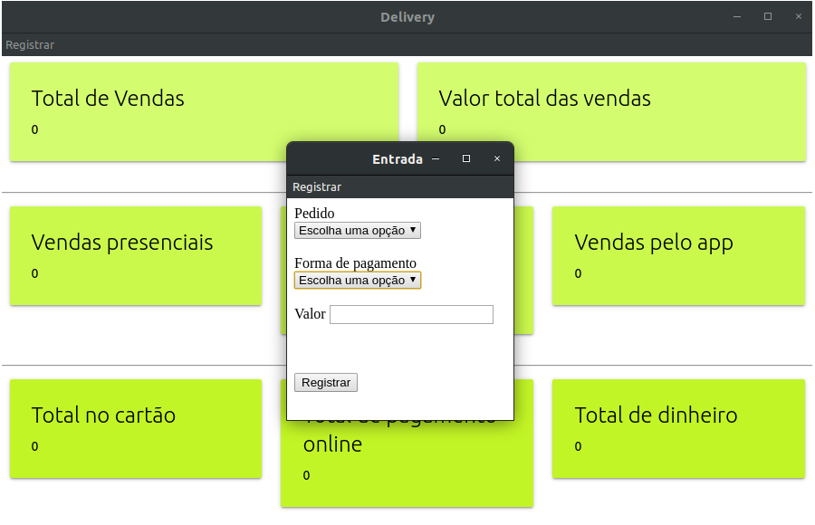

# delivery-control
An app for control money at delivery establishment using Electron.

Language in app: PT-BR.

## To use this app

To get started, clone the repo and install npm.

Open a terminal and:

```
cd delivery-control
```

Run:

```
npm install

npm start
```

For native app (electron-packager):

Windows:
```
npm package-win
```

Linux:
```
npm package-linux
```

Mac:
```
npm package-mac
```


## Screenshots

### Main window


### Add sale window




- [X] Control all sales and inputs
- [ ] Control all spending
- [ ] Plot information
- [X] Create styles

In progress...